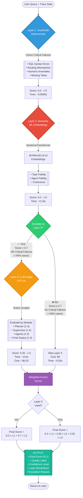

```mermaid
flowchart TB
    Start([User Query + Trace Data]) --> Layer1{Layer 1: Guardrails<br/>Deterministic}
    
    Layer1 -->|Check Critical Failures| L1_Checks[["• SQL Syntax Errors<br/>• Routing Mismatches<br/>• Numeric Anomalies<br/>• Missing Tasks"]]
    L1_Checks --> L1_Score[Score: 0.0 - 1.0<br/>Time: ~0.0005s]
    
    L1_Score --> Layer2{Layer 2: Semantic<br/>ML Embeddings}
    
    Layer2 -->|SentenceTransformer| L2_Embed["all-MiniLM-L6-v2<br/>Embeddings"]
    L2_Embed --> L2_Metrics[["• Task Fidelity<br/>• Agent Fidelity<br/>• Coherence"]]
    L2_Metrics --> L2_Score[Score: 0.0 - 1.0<br/>Time: ~0.13s]
    
    L2_Score --> Decision{Escalate to<br/>Layer 3?}
    
    Decision -->|"❌ NO<br/>Score ≥ 0.7<br/>No Critical Failures<br/>(~60% casos)"| Skip[Skip Layer 3<br/>Cost: $0<br/>Time: ~0.55s]
    
    Decision -->|"✅ YES<br/>Score < 0.7<br/>OR Critical Failures<br/>(~40% casos)"| Layer3{Layer 3: LLM-Judge<br/>GPT-4o}
    
    Layer3 -->|Rubric-Guided| L3_Rubric[["Evaluate by Module:<br/>• Planner (1-4)<br/>• Supervisor (1-4)<br/>• Agents (1-4)<br/>• Final Output (1-4)"]]
    L3_Rubric --> L3_Score[Score: 0.25 - 1.0<br/>Time: ~214s<br/>Cost: ~$0.02]
    
    L3_Score --> Fusion
    Skip --> Fusion
    
    Fusion[Weighted Fusion<br/>Scorer] --> Weights{Layer 3<br/>Used?}
    
    Weights -->|NO| Fast["Final Score =<br/>0.3 × L1 + 0.7 × L2"]
    Weights -->|YES| Deep["Final Score =<br/>0.3 × L1 + 0.35 × L2 + 0.35 × L3"]
    
    Fast --> Output
    Deep --> Output
    
    Output[["OUTPUT:<br/>• Final Score (0-1)<br/>• Quality Label<br/>• Confidence Level<br/>• Layer Breakdown<br/>• Escalation Reason"]]
    
    Output --> End([Return to User])
    
    style Layer1 fill:#3498db,stroke:#2980b9,stroke-width:3px,color:#fff
    style Layer2 fill:#e74c3c,stroke:#c0392b,stroke-width:3px,color:#fff
    style Layer3 fill:#f39c12,stroke:#e67e22,stroke-width:3px,color:#fff
    style Fusion fill:#9b59b6,stroke:#8e44ad,stroke-width:3px,color:#fff
    style Decision fill:#2ecc71,stroke:#27ae60,stroke-width:3px,color:#fff
    style Output fill:#1abc9c,stroke:#16a085,stroke-width:3px,color:#fff 
```