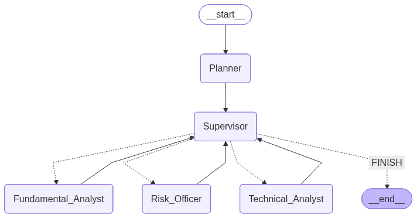

# AI Investment Committee: Sistema Multi-Agente Financiero
Este proyecto implementa una **Firma de Inversión basada en Agentes de IA**. Simula un comité de expertos financieros donde un **Supervisor (CIO)** orquesta a tres especialistas con roles definidos para asesorar sobre una cartera diversificada del mercado de criptomonedas, cubriendo activos de distintos perfiles de riesgo (**Bitcoin, Ethereum, Solana, BNB, XRP, Cardano y Dogecoin**).

El sistema combina Modelos de Machine Learning (Random Forest para predicción numérica), Búsqueda en Internet (Datos en vivo), RAG (Conocimiento técnico) y Análisis de Riesgos (Cálculo de volatilidad).



## Estructura del Proyecto

```plaintext
multiagent_evalutation/
├── orchestrator/          # Cerebro del sistema (LangGraph)
│   ├── agents.py          # Definición de Roles: Technical, Fundamental, Risk
│   ├── config.py          # Configuración de LLM (Ollama), rutas y MLflow
│   ├── graph.py           # Grafo de estados: Supervisor -> [Agentes]
│   ├── main.py            # Ejecución CLI con colores por rol
│   ├── prompts.py         # Gestión centralizada de Personalidades y Grounding
│   ├── tools.py           # Herramientas: SQL, ML, Gráficos, Volatilidad, WebSearch
│   └── utils.py           # Decoradores de logs y utilidades
├── crypto/
│   ├── crypto_data.db     # Base de datos SQLite con precios históricos
│   ├── RAG_KNOWLEDGE.txt  # Conocimiento técnico (Halving, Consensus, Macro)
│   ├── models/            # Modelos .joblib entrenados (Random Forest)
│   ├── plots/             # Gráficas de validación de los modelos ML
│   └── src/               # Backend de ML
│       ├── data_manager.py    # ETL: Descarga de Yahoo Finance
│       ├── trainer.py         # Entrenamiento + Validación
│       └── predictor.py       # Inferencia para el Agente
└── evaluation/
│   ├── accumulated_data/  # Sistema de Acumulación de Métricas
│   │   ├── dataset_unified_results.csv   # Métricas unificadas de los 3 sistemas (generado)
│   │   ├── online_metrics.csv   # Métricas desde Streamlit (generado)
│   │   └── offline_metrics.csv  # Métricas desde run_eval.py (generado)
│   ├── baseline/          # Fase 1: Métricas Automáticas Deterministas
│   │   ├── init.py
│   │   ├── state.py       # Modelos Pydantic para métricas baseline
│   │   ├── metrics.py     # Calculador de métricas (routing, numeric, SQL)
│   │   ├── run_eval.py    # Batch evaluation sobre dataset.json
│   │   ├── BASELINE_EVALUATION_GUIDE.md  # Documentación completa
│   │   ├── dataset_baseline_results.csv  # Resultados completos (generado)
│   │   └── dataset_baseline_summary.csv  # Resumen ejecutivo (generado)
│   ├── llm_j/             # Fase 2: LLM-as-a-Judge (Evaluación Cualitativa)
│   │   ├── init.py
│   │   ├── state.py       # Modelos Pydantic para evaluaciones LLM
│   │   ├── prompts.py     # Prompts especializados por módulo
│   │   ├── judge.py       # Lógica del evaluador LLM
│   │   ├── run_eval.py    # Batch evaluation
│   │   ├── LLM_JUDGE_EVALUATION_GUIDE.md  # Documentación completa
│   │   ├── dataset_llmj_results.csv      # Resultados completos (generado)
│   │   └── dataset_llmj_summary.csv      # Resumen ejecutivo (generado)
│   ├── hybrid/             # Fase 3: HACE (Hybrid Agent Consensus Evaluator)
│   │   ├── __init__.py
│   │   ├── layer1_guardrails.py  # Capa 1: Validadores deterministas (hallucinations, SQL, coverage)
│   │   ├── layer2_semantic.py    # Capa 2: Evaluación semántica basada en Embeddings y Similitud de Coseno
│   │   ├── layer3_llm.py         # Capa 3: LLM-as-a-Judge selectivo (activado por lógica de escalado)
│   │   ├── scorer.py             # Algoritmo de ponderación y fusión de scores entre capas
│   │   ├── orchestrator.py       # Pipeline de evaluación híbrida y lógica de escalado condicional
│   │   ├── run_eval.py           # Batch evaluation del sistema híbrido sobre dataset completo
│   │   ├── optimization_hace.py  # Optimización de los hiperparámetros del sistema HACE
│   │   ├── HYBRID_EVALUATION_GUIDE.md  # Documentación completa
│   │   ├── hace_calibration_results.csv  # Resultados detallados del grid de Hiperparámetros (generado)
│   │   ├── dataset_hybrid_results.csv  # Resultados detallados por caso (generado)
│   │   └── dataset_hybrid_summary.csv  # Resumen ejecutivo con métricas de eficiencia (generado)
│   ├── metrics_accumulator/  # Sistema de Logging de Métricas
│   │   ├── __init__.py
│   │   ├── logger.py      # MetricsLogger class (logging unificado)
│   │   ├── run_eval_gloabl.py      # Batch evaluation de los 3 sistemas sobre dataset completo
│   │   ├── METRICS_ACCUMULATOR.md      # Documentación del logger
│   │   └── dataset.json   # Dataset sintético de 80 casos de prueba
│   └── visualization/     # Generación de Gráficas
│       ├── __init__.py
│       ├── plot_baseline.py       # Gráficas de Baseline Metrics
│       ├── plot_hybrid.py         # Gráficas de HACE
│       ├── plot_llm_judge.py      # Gráficas de LLM-Judge
│       ├── plot_comparison.py     # Comparativas Baseline, LLM-Judge y HACE
│       └── plots/                 # Directorio de salida de gráficas
├── pages/          # Sub-páginas del Frontend
│   └── 1_dashboard.py     # Dashboard con gráficas y cálculos de los sistemas de evaluación
├── app.py            # Interfaz Streamlit de usuario con evaluación integrada
└── setup_rag.py           # Script para vectorizar conocimiento
```
## Prerrequisitos
Este sistema funciona 100% en local para garantizar privacidad y coste cero.
- Python 3.10+
- Ollama: Debes tener Ollama instalado y corriendo.
[Descargar Ollama](https://ollama.com/download)
```bash
ollama run llama3.1
```
## Guía de Ejecución

Para poner en marcha el sistema completo, debes seguir este orden lógico: Datos -> Entrenamiento -> Conocimiento -> Aplicación.

### Fase 1: Ingeniería de Datos y Entrenamiento (Backend ML)
#### Módulo de Criptomonedas (Crypto)

| Paso | Comando                         | Descripción                                                                 |
|-----:|---------------------------------|-----------------------------------------------------------------------------|
| 1    | `python -m crypto.src.data_manager` | Descarga datos de las criptomonedas y los guarda en la DB.          |
| 2    | `python -m crypto.src.trainer`      | Entrena modelos Random Forest por moneda y muestra el MAE y la precisión.                |
| 3    | `python -m crypto.src.predictor`    | Carga el modelo entrenado y predice el próximo precio de cierre.           |

### Fase 2: Configuración del RAG (Base de Conocimiento)
Vectorizamos los archivos de texto (RAG_KNOWLEDGE.txt) para que los agentes puedan consultar teoría o datos cualitativos.
Asegúrate de que existan los archivos .txt en la carpeta crypto/

Ejecuta:
```bash
python setup_rag.py
```

### Fase 3: Ejecución del Sistema Agéntico
Tienes dos formas de interactuar con el sistema:

Opción A: Interfaz Gráfica (Recomendado) Visualiza el proceso de pensamiento del Supervisor y los Agentes en tiempo real.
```bash
streamlit run app.py --server.port 8086
```
**Características de la interfaz:**
- Chat interactivo con el comité de inversión
- Visualización de gráficos generados
- Inspector de ejecución (herramientas, outputs, reportes)
- **Sistema de auditoría dual** (LLM-Judge + Baseline Metrics)
- Historial de evaluaciones persistente

---
Opción B: Consola (CLI) Interacción rápida por terminal.
```bash
python -m orchestrator.main
```

### Fase 4: Evaluación y Calibración Offline 
El sistema cuenta con un pipeline completo para evaluar su propio rendimiento de forma rigurosa usando un dataset sintético de 45 casos (`dataset.json`).

**1. Evaluación Unificada:**
Para ejecutar los tres evaluadores (Baseline, LLM-Judge y HACE) en lote sobre todo el dataset y consolidar los resultados:
```bash
python -m evaluation.metrics_accumulator.run_eval_global
```

Salida principal: evaluation/accumulated_data/dataset_unified_results.csv

**2. Optimización de Hiperparámetros (LOO-CV):**
Para calibrar los pesos de la arquitectura HACE sin introducir Data Leakage, el sistema incluye un optimizador basado en Leave-One-Out Cross-Validation frente a un Heuristic Reference Score:
```bash
python -m evaluation.hybrid.optimization_hace
```
Salida principal: evaluation/hybrid/hace_calibration_results.csv 
y gráfica de sensibilidad en evaluation/visualization/plots/.

---

## Características Avanzadas
### Observabilidad con MLflow
El proyecto integra MLflow para la trazabilidad completa de la IA.
1. Interactúa con el chat en Streamlit.
2. Ejecuta en otra terminal: mlflow ui.
```bash
uv run mlflow ui --backend-store-uri sqlite:///mlruns/mlflow.db
```
3. Accede a http://127.0.0.1:5000 para ver:
- Traces: Diagramas de cascada (Waterfall) de cada interacción Agente-Herramienta.
- Latencia: Tiempos de respuesta de cada nodo.

### Guardrails y Grounding Dinámico
El sistema implementa mecanismos de seguridad robustos:
- Introspección de Esquema: Los agentes leen la base de datos al inicio para saber qué tablas (Monedas) existen realmente.
- Anclaje (Grounding): Si preguntas por una ciudad que no está en la DB, el agente rechazará la pregunta en lugar de alucinar datos.
- Prompting Estricto: Reglas explícitas para diferenciar entre un dato histórico (SQL) y una predicción (ML).

### Tipos de Auditoría Implementados

#### Baseline Metrics (Métricas Automáticas)
Evaluación **100% determinista** sin uso de LLMs. Basada en comparación directa de outputs vs evidencia técnica.

**Métricas calculadas:**

| Métrica | Descripción | Rango | Objetivo |
|---------|-------------|-------|----------|
| **Routing Accuracy** | Precisión del enrutamiento tarea→agente | 0-1 | ≥0.95 |
| **Numeric Fidelity** | % de números del agente presentes en tool output | 0-1 | ≥0.90 |
| **Hallucination Rate** | % de números inventados por el agente | 0-1 | ≤0.10 |
| **Task Coverage** | % de tareas planificadas que se completaron | 0-1 | ≥0.95 |
| **SQL Correctness** | % de queries SQL que siguen patrones correctos | 0-1 | ≥0.90 |

##### **Evaluación Offline (Batch):**
```bash
python -m evaluation.baseline.run_eval
```

**Salida:**
```
evaluation/baseline/dataset_baseline_results.csv    # Resultados completos
evaluation/baseline/dataset_baseline_summary.csv    # Resumen ejecutivo
```

---

#### LLM As A Judge
El LLM Evaluador analiza la triada: Pregunta Usuario → Contexto Técnico (SQL/Tool) → Respuesta Agente y evalúa (Score 1-4) en base a la Fidelidad del Dato y Validación de Procedimiento.

##### **Evaluación Offline (Batch):**
```bash
python -m evaluation.llm_j.run_eval
```

**Salida:**
```
evaluation/llm_j/dataset_llmj_results.csv    # Resultados completos
evaluation/llm_j/dataset_llmj_summary.csv    # Resumen ejecutivo
```

**Módulos evaluados (Escala 1-4):**

| Módulo | Dimensiones Evaluadas | Score |
|--------|----------------------|-------|
| **Planner** | Correctness, Completeness, Precision, Task Decomposition | 1-4 |
| **Supervisor** | Routing Accuracy, Task Completion | 1-4 |
| **Agentes** | Tool Selection, Tool Execution, Output Fidelity, Completeness, Hallucination Check | 1-4 |
| **Output Final** | Completeness, Accuracy, Structure, Chart Attribution | 1-4 |

**Interpretación de Scores:**
- **4**: Perfecto (equivalente a 9-10 en escala anterior)
- **3**: Bueno (equivalente a 7-8)
- **2**: Mejorable (equivalente a 5-6)
- **1**: Crítico (equivalente a 0-4)

**Características:**
- Detección de errores semánticos
- Chain-of-Thought reasoning
- Análisis narrativo por módulo
- Categorización de errores

**Categorías de Error Detectadas:**

- `None`: Sistema funcionando correctamente (Score ≥ 3)
- `Planning_Error`: Planner omitió tareas o perdió precisión
- `Routing_Error`: Supervisor asignó agente incorrecto
- `Tool_Error`: Agente ejecutó mal una herramienta
- `Fabrication`: Agente inventó datos (alucinación)
- `Incompleteness`: Tareas omitidas en el flujo
- `Risk_Negligence`: Risk Officer no advirtió riesgo alto

---

### HACE Metrics (Hybrid - Escala 0-1) 

**HACE** (Hybrid Agent Consensus Evaluator) combina validación determinista, evaluación semántica con embeddings, y LLM-Judge selectivo en una arquitectura de 3 capas.

| Campo | Descripción | Rango |
|-------|-------------|-------|
| `HACE_score` | Score global híbrido final | 0-1 |
| `HACE_quality` | Label cualitativo | `Excelente`, `Bueno`, `Mejorable`, `Crítico` |
| `HACE_confidence` | Nivel de confianza en evaluación | `high`, `medium`, `low` |
| `HACE_layer1` | Score Layer 1 (Guardrails) | 0-1 |
| `HACE_layer2` | Score Layer 2 (Semantic) | 0-1 |
| `HACE_layer3` | Score Layer 3 (LLM-Judge) | 0-1 (null si no se usó) |
| `HACE_layer3_used` | ¿Se escaló a Layer 3? | 0 (No) o 1 (Sí) |
| `HACE_time` | Tiempo total de evaluación | >0 |

**Componentes de HACE:**

1. **Layer 1 (Guardrails):** Validadores deterministas
   - Completitud estructural
   - Sintaxis de routing
   - Rangos numéricos plausibles
   - Existencia de archivos mencionados

2. **Layer 2 (Semantic):** Evaluación semántica con embeddings
   - Task Fidelity (BERTScore-inspired)
   - Agent Fidelity (similitud tool output vs respuesta)
   - Routing Quality (keywords ponderados)
   - Report Completeness

3. **Layer 3 (LLM-Judge Selectivo):** Solo se ejecuta en ~40% de casos
   - Evaluación profunda de módulos problemáticos detectados en Layer 1-2
   - Usa el mismo LLM-Judge de evaluación cualitativa
   - Escalación basada en fallos críticos, scores ambiguos o discrepancias

**Ventajas vs sistemas individuales:**
- Mejor reproducibilidad
- Cobertura semántica completa (vs Baseline que solo valida numérico/estructural)
- Menor costo (menos llamadas a LLM que LLM-Judge puro)

**Papers base:**
- BERTScore (Zhang et al., 2019) - Similitud semántica
- ARES (Saad-Falcon et al., 2023) - Clasificadores binarios para RAG
- Cascading LLMs (Chen et al., 2023) - Routing adaptativo
- Prometheus (Kim et al., 2023) - Rubric-guided evaluation

---

### Sistema de Acumulación de Métricas

El sistema ahora **acumula automáticamente** todas las evaluaciones en CSVs unificados:

**Ubicación:** `evaluation/accumulated_data/`
- `online_metrics.csv` - Evaluaciones desde Streamlit (sesiones de usuario)
- `offline_metrics.csv` - Evaluaciones batch desde `run_eval.py`

**Ventajas:**
- Histórico completo de evaluaciones (online + offline)
- Base de datos para fine-tuning futuro de prompts
- Detección de drift del sistema (¿empeora con el tiempo?)
- Análisis de patrones de error
- Training data para reward models (RL)
- A/B testing de variantes de prompts

**Ver estadísticas:** En Streamlit, botón **"Ver Estadísticas"** en el sidebar muestra:
- Total de evaluaciones
- Scores promedio (Baseline y LLM-Judge)
- Tasa de alucinaciones
- Distribución de categorías de error
- Rango de fechas

**Formato de datos:** Ver `evaluation/accumulated_data/README.md` para detalles completos del esquema.

---

## Generación de Visualizaciones

El sistema incluye **scripts de generación automática de gráficas** para análisis comparativo.

### **Paso 1: Ejecutar Evaluaciones Offline**
Puedes ejecutar los evaluadores por separado, o usar el script global unificado (Recomendado):

```bash
# RECOMENDADO: Ejecutar los 3 evaluadores a la vez y unificar resultados
python -m evaluation.metrics_accumulator.run_eval_global

# Opcional: Ejecutar individualmente
python -m evaluation.baseline.run_eval
python -m evaluation.llm_j.run_eval
python -m evaluation.hybrid.run_eval
```

### **Paso 2: Generar Gráficas**
```bash
# Gráficas de Baseline
python -m evaluation.visualization.plot_baseline

# Gráficas de LLM-Judge
python -m evaluation.visualization.plot_llm_judge

# Gráficas de Hybrid
python -m evaluation.visualization.plot_hybrid

# Gráficas Comparativas
python -m evaluation.visualization.plot_comparison
```

### **Gráficas Generadas**

#### **Baseline Metrics:**
- `baseline_metrics_distribution.png` - Distribución de las 4 métricas
- `baseline_by_difficulty.png` - Desempeño por nivel de dificultad
- `baseline_hallucination_analysis.png` - Análisis detallado de alucinaciones
- `baseline_sql_correctness.png` - Desglose de SQL correctness
- `baseline_correlation_heatmap.png` - Correlación entre métricas

#### **LLM-Judge:**
- `llm_judge_modules_boxplot.png` - Scores por módulo (Planner, Supervisor, etc.)
- `llm_judge_error_categories.png` - Distribución de categorías de error
- `llm_judge_by_difficulty.png` - Overall score por dificultad

#### **Comparativas:**
- `comparison_scores.png` - Histograma + Boxplot de scores
- `comparison_time.png` - Bar chart de tiempos de evaluación
- `comparison_correlation.png` - Scatter plot de correlación entre métodos
- `comparison_by_difficulty.png` - Desempeño por dificultad (ambos métodos)
- `comparison_summary_table.png` - Tabla resumen comparativa

**Ubicación:** `evaluation/visualization/plots/`

---

## Arquitectura del Sistema
### 1. El Supervisor (Router)

**Rol:** Enrutamiento inteligente.  
**Lógica:** Analiza el intent del usuario.

- ¿Pide precio/gráfico? → **Technical Analyst**
- ¿Pide noticias/conceptos? → **Fundamental Analyst**
- ¿Pide seguridad/riesgo? → **Risk Officer**
- ¿Charla/Saludo? → **FINISH**

---

### 2. Los Sub-Agentes (ReAct)

Cada sub-agente dispone de autonomía para razonar sobre la consulta del usuario (Reason) y decidir qué herramienta ejecutar (Act) en función del contexto temporal y semántico de la pregunta.

| Agente | Rol (Prompt) | Herramientas Principales | Input / Output |
|--------|--------------|-------------------------|----------------|
| **Technical Analyst** | Quant. Frío, numérico, objetivo. | `crypto_history` (SQL) <br> `crypto_prediction` (ML) <br> `crypto_chart` (Matplotlib) | Genera Gráficos .png y tablas de precios |
| **Fundamental Analyst** | Researcher. Educativo y contextual. | `crypto_news` (Web Search) <br> `crypto_rag` (Vectores) | Busca Noticias en vivo y explica tecnología |
| **Risk Officer** | Skeptic. Pesimista y cauteloso. | `crypto_volatility` (Pandas) | Calcula Desviación Estándar y emite alertas |

---

### 3. Componentes de ML (Backend)

- **data_manager.py**  
  Se encarga del proceso ETL (Extraer, Transformar y Limpiar).  
  Crea las bases de datos SQLite y gestiona las tablas para cada activo.

- **trainer.py**  
  Implementa un `RandomForestRegressor`.  
  Realiza un *split* cronológico (80/20) para garantizar que el modelo no "prediga el pasado" y guarda los modelos optimizados en la subcarpeta `models/`.

- **predictor.py**  
  Punto de entrada para el usuario.  
  Recibe los últimos datos conocidos (*lags*) y devuelve la predicción numérica utilizando los archivos `.joblib`.